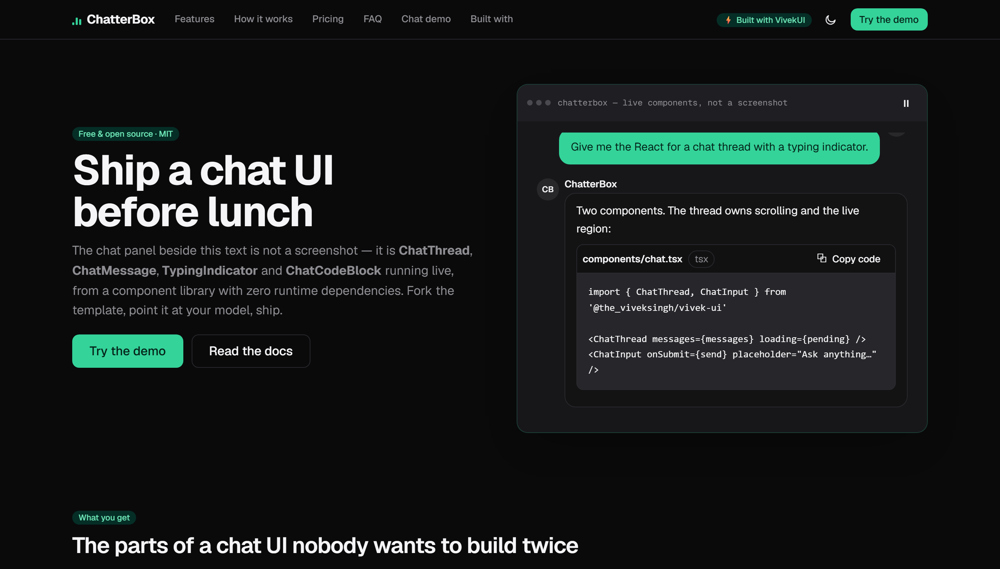

# ChatterBox — Free AI Chatbot UI Template (React / Next.js)

[](./LICENSE)
[](https://nextjs.org)
[](https://react.dev)
[](https://www.typescriptlang.org)
[](https://www.npmjs.com/package/@the_viveksingh/vivek-ui)
[](https://www.npmjs.com/package/@the_viveksingh/vivek-ui)

A complete, production-quality **AI chatbot UI template** — landing page plus a working
mock chat app — built entirely with [VivekUI](https://ui.vivekkumarsingh.in/docs?utm_source=vivekui-template&utm_campaign=aichat&utm_medium=readme),
a free React component library with **zero runtime dependencies**.

**[▶ Live demo](https://aichat-vivekui.vercel.app)** · **[Chat app](https://aichat-vivekui.vercel.app/chat)** · **[Every component used](https://aichat-vivekui.vercel.app/built-with)**



<sub>The panel on the right is not an image in the app — that is `ChatThread` running. The
screenshot above is a capture of it mid-loop.</sub>

---

## Why this template exists

VivekUI ships an **AI chat component family that almost no free UI library includes** —
`ChatThread`, `ChatMessage`, `ChatInput`, `TypingIndicator`, `ChatCodeBlock`. This template
exercises all of it, and adds the trick that tends to surprise people:

> **The chat thread, typing indicator, code blocks _and_ the in-chat charts all come from
> one zero-dependency package.**

Open the demo and type **"show me a chart"** — the assistant answers with a real SVG
`BarChart` rendered *inside the message bubble*. No canvas, no d3, no second package.

## Highlights

- **The hero is not a screenshot.** It is a live `ChatThread` playing a scripted
  conversation on a timed loop, with a `TypingIndicator` between turns and a real
  `ChatCodeBlock` answer. It has a pause control, and `prefers-reduced-motion` gets the
  finished transcript with no timers ever scheduled.
- **Charts inside chat messages.** A `ChatMessage`'s content is a React node, not a
  markdown string, so a chart is simply another child of the bubble.
- **A working chat app** at `/chat` — conversation sidebar with relative timestamps,
  search, suggestion chips, `EmptyState`, Enter-to-send, and copy-to-clipboard with a
  `Toast`.
- **No model, no API key, no network.** Replies are keyword-matched from
  [`data/replies.ts`](./data/replies.ts). Nothing you type leaves the browser.
- **Dark mode by default**, emerald accent, and theming through CSS custom properties —
  the whole accent is two declarations in [`app/globals.css`](./app/globals.css).
- **SEO + AEO wired up**: Metadata API per route, `sitemap.ts`, `robots.ts`,
  `SoftwareApplication` + `Offer` / `FAQPage` / `BreadcrumbList` JSON-LD, and
  [`public/llms.txt`](./public/llms.txt).
- **Accessible**: one `h1` per page, visible focus, WCAG AA contrast, reduced-motion
  support, skip link, and zero console errors.

## Stack

| | |
|---|---|
| Framework | Next.js 16.3 (App Router, Turbopack) |
| UI | `@the_viveksingh/vivek-ui` 0.5.x — **the only UI dependency** |
| Language | TypeScript 5 · React 19 |
| Runtime | Node.js 20.9+ (22 LTS recommended) |
| Styling | Plain CSS custom properties. No Tailwind, no CSS-in-JS. |

## Quick start

```bash
git clone https://github.com/intellectwithvivek/nextjs-ai-chatbot-ui-template-vivekui.git
cd nextjs-ai-chatbot-ui-template-vivekui
npm install
npm run dev
```

Open <http://localhost:3000>.

Adding VivekUI to a project of your own is two lines:

```bash
npm i @the_viveksingh/vivek-ui
```

```tsx
// app/layout.tsx
import '@the_viveksingh/vivek-ui/styles.css'
import '@the_viveksingh/vivek-ui/charts.css'  // only if you use charts
```

## Deploy

[](https://vercel.com/new/clone?repository-url=https%3A%2F%2Fgithub.com%2Fintellectwithvivek%2Fnextjs-ai-chatbot-ui-template-vivekui&project-name=chatterbox&repository-name=chatterbox)

No environment variables are required — there is no backend to configure.

## Wiring it to a real model

The components never touch the network. Replace the keyword matcher with a call of your
own and you have a real assistant:

```tsx
// components/chat-app.tsx — replace matchReply(text) with:
const res = await fetch('/api/chat', {
  method: 'POST',
  body: JSON.stringify({ message: text }),
})
const { reply } = await res.json()
```

Append tokens to the last message as they arrive and `ChatThread` renders the stream. Any
provider works — Anthropic, OpenAI, Mistral, or an open-weights model on your own
hardware.

## Project layout

```
app/
  layout.tsx            root layout: ThemeProvider, ToastProvider, navbar, footer
  page.tsx              landing page
  chat/page.tsx         the mock chat app
  built-with/page.tsx   component attribution table
  opengraph-image.tsx   OG card, generated at build time
  sitemap.ts robots.ts  SEO routes
  globals.css           emerald accent + site identity
components/
  hero-demo.tsx         the auto-playing hero conversation
  chat-app.tsx          the /chat shell
  reply-blocks.tsx      maps a reply block to a component (incl. the in-chat chart)
data/
  replies.ts            canned replies, keyword-matched
  conversations.ts      mock sidebar conversations
  content.ts            landing copy, chart data, /built-with map
lib/
  site.ts               URLs + UTM helper
  schema.ts             JSON-LD builders
public/llms.txt         AEO
```

## Customising

| Want to change | Edit |
|---|---|
| Accent colour | `--vk-color-primary` in [`app/globals.css`](./app/globals.css) |
| What the bot says | [`data/replies.ts`](./data/replies.ts) |
| Landing copy, charts, pricing | [`data/content.ts`](./data/content.ts) |
| Site URL, repo, UTM tags | [`lib/site.ts`](./lib/site.ts) |
| Default theme | `defaultTheme` in `app/layout.tsx` **and** `lib/theme-script.ts` |

## Powered by VivekUI

**[VivekUI](https://ui.vivekkumarsingh.in/docs?utm_source=vivekui-template&utm_campaign=aichat&utm_medium=readme)** — 91 React components · 6 SVG charts · zero runtime dependencies.
One install, one CSS import, no config.

- 📚 [Documentation](https://ui.vivekkumarsingh.in/docs?utm_source=vivekui-template&utm_campaign=aichat&utm_medium=readme)
- 🧩 [Component reference](https://ui.vivekkumarsingh.in/docs/components?utm_source=vivekui-template&utm_campaign=aichat&utm_medium=readme)
- 📦 [npm](https://www.npmjs.com/package/@the_viveksingh/vivek-ui)
- ⭐ [GitHub](https://github.com/intellectwithvivek/vivek_UI)
- 👤 [Vivek Kumar Singh](https://vivekkumarsingh.in/?utm_source=vivekui-template&utm_campaign=aichat&utm_medium=readme)

## License

[MIT](./LICENSE) — free for commercial use.

The "Built with VivekUI" credit in the footer is **removable**; it is there because it
helps the project. A ⭐ on [the library](https://github.com/intellectwithvivek/vivek_UI)
is genuinely appreciated.
